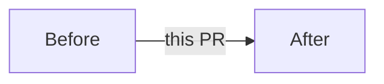

<!-- Classification (size/S-M-L-XL, risk/low-medium-high) is computed by CI -
     no boxes to tick for what a machine computes better. The title is linted
     by CI too: Conventional Commits (`type(scope)!: subject`). -->

## Need

<!-- What problem or need does this address? One synthetic paragraph.
     Link the issue/request if one exists. -->

## Answer

<!-- How does this PR answer that need? Key decisions and their rationale,
     written so someone outside the change can follow. -->

## Visual

<!-- Encouraged whenever the change has structure or a UI surface.
     Delete the example below when done. Mermaid renders natively on
     GitHub; screenshots (before / after) for anything visible: -->

<!-- Screenshots table for anything visible:

| Before | After |
|---|---|
|  |  |
-->

## Validation

<!-- How was this verified? Commands run, tests added, manual steps. -->

## Breaking changes

<!-- none, or what breaks + migration notes -->
