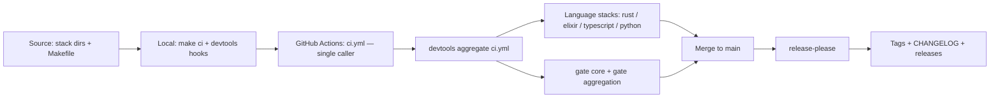

# Architecture

## Purpose

This repository is a template: a multi-language monorepo skeleton that
generated projects start from. The architecture optimizes for two things:
(1) keeping every stack optional with zero configuration edits, and (2) one
consistent local and CI experience regardless of which stacks are kept.

## Layout rationale

Each stack lives in a top-level directory and is auto-detected by a marker
file:

| Stack | Directory | Marker |
|---|---|---|
| Rust | rust/ | Cargo.toml |
| TypeScript | typescript/ | package.json |
| Elixir | elixir/ | mix.exs |
| Python | python/ | pyproject.toml |

The Makefile probes markers at runtime: an absent marker prints
`[target] skipped (no <marker>)` and the target succeeds. Deleting a stack is
therefore a pure deletion exercise — the stack dir plus its CI, Dependabot,
and release-please entries (see MANIFEST.md) — with zero Makefile edits.

## Flow

Local gates (devtools pre-commit hooks + `make ci`) and CI gates (the
aggregate ci.yml + security.yml) run the same commands, so a green local
run predicts a green CI run. Merges to main trigger release-please,
which derives versions and changelogs from Conventional Commits.

## Where things live

| Concern | Location |
|---|---|
| Local entrypoint | Makefile (canonical targets: help, hooks, format, lint, test, build, ci, clean) |
| Local hooks | .devtools/hooks via `core.hooksPath` (set by `make hooks`) |
| CI | ci.yml (one caller job); all stack logic in the devtools aggregate |
| Security scan | .github/workflows/security.yml + .gitleaks.toml |
| Releases | .github/workflows/release.yml + release-please-config.json |
| Governance | AGENTS.md, CONTRIBUTING.md, SECURITY.md, CODE_OF_CONDUCT.md |
| Bootstrap inventory | MANIFEST.md |
| Decisions | docs/architecture/decisions/ (ADRs) |

## Decisions

Architecture decisions are recorded as ADRs in
docs/architecture/decisions/ — see
docs/architecture/decisions/0001-record-architecture-decisions.md.
