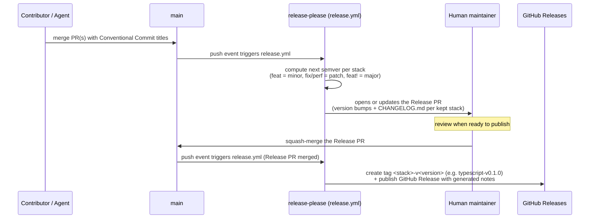

# Release process

## TL;DR

Merging conventional commits to `main` is all it takes. release-please
accumulates them into a single **Release PR**; merging that one PR
publishes the version: tags and GitHub Releases with notes are created
automatically. No manual `git tag`, no hand-written changelog, ever.

## Rules

- **Never edit `CHANGELOG.md` by hand** - it is generated. Fix the commit
  history instead (a follow-up Release PR corrects course).
- **Tags are immutable** - a wrong release is fixed forward by cutting the
  next one, never by retagging.
- **Only release-please creates tags/releases** on this repository.
  Tags are component-prefixed per stack (`typescript-v<version>`,
  `python-v<version>`, ...) - include-component-in-tag is on by default
  for multi-package repos.
- Commit types drive versions: `feat` bumps minor, `fix`/`perf` bump
  patch, `feat!` or a `BREAKING CHANGE:` footer bumps major; other types
  do not bump.

## Failure modes

- **Release workflow red** - usually means GitHub Actions is not allowed
  to create pull requests (common under org policies). Remedy: org admin
  enables *Allow GitHub Actions to create and approve pull requests*
  under Organization → Settings → Actions → Workflow permissions.
- **No Release PR appears** - normal when only non-bumping commits
  (`docs:`, `chore:`...) landed since the last release.
- **Wrong version** - fix forward via a follow-up Release PR; tags are
  immutable.
